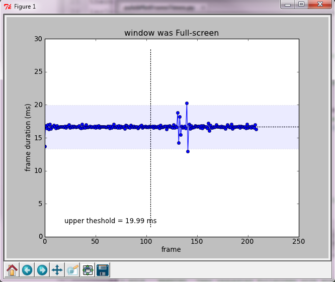

.. _installation:

************
Installation
************

To use pyEyeTracker you generally need to install whe package you will be using to run your
experiments with, and then install pyEyeTracker as well. The following installation instructions
assume you are using `PsychoPy <http://www.psychopy.org/>`_ for the experiment runtime, as it is 
supported by pyEyeTracker out of the box so to speak. 

.. _installing-PsychoPy:

Installing PsychoPy
===================

Please follow the latest installation instructions on installing PsychoPy for your platform
from the PsychoPy 'installation web page <http://www.psychopy.org/installation.html>'_ .

** Please note that as of the inital release only Windows is supported. This will be corrected, for
the eye tracker interfaces that are able to support other platforms, shortly. **

Then 'download <http://code.google.com/p/psychopy/>'_ the latest PsychoPy package fo your OS. Note that
there is a very nice self installer available for Windows which includes everything needed to run PsychoPy,
including the Python runtime environment. As of writting, it is the file named **StandalonePsychoPy-1.73.02-win32.exe**.

Once you have installed PsychoPy, you should be able to launch the apppication ( for example in Windows from 
Start->PsychoPy2->PsychoPy2 ), which will start the PsychoPy IDE, as seen below. If the GUI you see looks different than below,
you are likely in the *builder* IDE mode of PsychoPy. Switch to the *coder* mode by selecting the PsychoPy menu 
**View->Go to Coder View**.

.. image:: _static/psychopy2_coder_ide.png 

To test that everything is working well in PsychoPy, select the PsychoPy menu 

**Demos->Timing->pylabPlotFrames.py**

and the pylabPlotFrames.py script should load into the code editor panel of the IDE, as seen below.

.. image:: _static/pylabPlotFrameTimes.png 

To run the script, press on the Green circle icon at the top of the PsychoPy IDE window that has a picture of a runner in it. 
This should launch the python script, run the retrace timing test, and then plot the retrace points obtained from
the test, as seen below.

Assuming this all worked as it should, you are good to move on with installing the pyEyeTracker package.

.. _installing-pyEyeTracker:

Installing PyEyeTracker
=======================

After you have installed PsychoPy and tested that it is running, please ensure that PsychoPy is closed down.

Downloaded the latest version of PyEyeTracker for your platform. Only eye tracker extensions that are supported on the OS
you are downloading for will be included in that package.

** Please note that at this time, pyEyeTracker only supports Windows Windows XP SP2 or Windows 7. Support for OS X and Linus will be added soon, 
for those eye tracker interfaces that can run on platforms other than Windows. **

Windows Installation
++++++++++++++++++++

The pyEyeTracker is currently simply distributed as a pyeyetracker directory compressed in either a rar or zip file. 
Please download the compressed file of your choice and uncpress the pyEyeTracker directory to the following location:

#. If you installed the standalone PsychoPy distribution, copy the pyEyeTracker directory to 

    [INSTALL_DIR]\PsychoPy2\Lib\Site-Packages\.

where [INSTALL_DIR] is the path of your "Program Files" directory that you installed PsychoPy2 to. On a Windows 32 bit PC, this will normally be:

    C:\Program Files\PsychoPy2\Lib\Site-Packages\.

On a Windows 64 bit PC, it will normally be:

    C:\Program Files(x86)\PsychoPy2\Lib\Site-Packages\.

#. If you installed PsychoPy into an existing Python distribution, copy the pyEyeTracker directory to your existing Python distributions site-packages directory. 

    [PYTHON_INSTALL]\Lib\Site-Packages\.

where [INSTALL_DIR] is the path of your Python installation base directory that you installed PsychoPy2 to. 
For example if running Python 2.7, it would usually be C:\Python27 , so the full to copy pyEyeTracker to would be

    C:\Python27\Lib\Site-Packages\.

You can now test that pyEyeTracker is being picked up by the python interpreter that PsychoPy is also using by relaunching the PsychoPy IDE and in the IDE
interactive python interpreter window type:

    import pyeyetracker
    print pyeyetracker.supportedTrackers()

You should not receive any errors and a list of supported eye trackers should be printed to the screen.

Add external files (if required)
++++++++++++++++++++++++++++++++

Some eye tracker implemetations of the pyEyeTracker interface require that you get some necessary files from the manufacturer
and copy them into the appropriate manufacturers pyEyeTracker interface subdirectory before the interface for that eye tracker will work.
Other eye trackers either use an interface that does not require extra files, or have allowed us to distribute those files with the 
pyEyeTracker module so that it is easier for you to use. To determine if you do need to get and install any extra files before the specific
implementation of the pyEyeTracker interface you plan on using will work, please see the :ref:`Supported-EyeTracker-List` page, which also includes
links to a dedicated page for each supported tracker and any instructions you need to follow should you have to get extra files.
